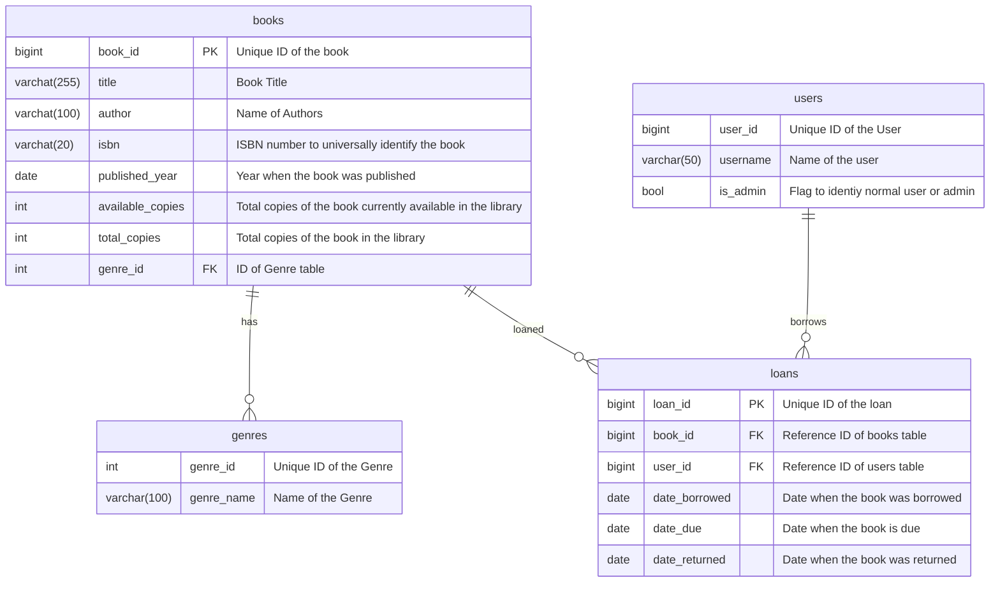

```mermaid
erDiagram
    books {
        bigint book_id PK "Unique ID of the book"
        varchat(255) title "Book Title"
        varchat(100) author "Name of Authors"
        varchat(20) isbn "ISBN number to universally identify the book"
        date published_year "Year when the book was published"
        int available_copies "Total copies of the book currently available in the library"
        int total_copies "Total copies of the book in the library"
        int genre_id FK "ID of Genre table"
    }

    genres {
        int genre_id "Unique ID of the Genre"
        varchar(100) genre_name "Name of the Genre"
    }

    users {
        bigint user_id "Unique ID of the User"
        varchar(50) username "Name of the user" 
        bool is_admin "Flag to identiy normal user or admin"
    }

    loans {
        bigint loan_id PK "Unique ID of the loan" 
        bigint book_id FK "Reference ID of books table"
        bigint user_id FK "Reference ID of users table" 
        date date_borrowed "Date when the book was borrowed"
        date date_due "Date when the book is due" 
        date date_returned "Date when the book was returned"
    }

    books ||--o{ genres : has
    users ||--o{ loans : borrows
    books ||--o{ loans : loaned

```